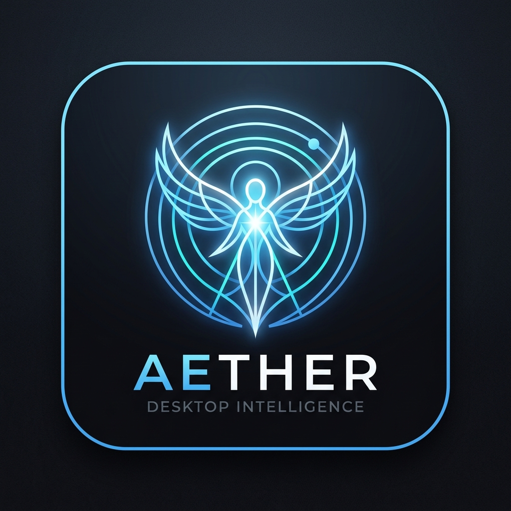

<p align="center">
  
</p>

# Project Aether: Offline-First Desktop Intelligence Agent

[](LICENSE)
[](https://www.python.org/downloads/)
[](https://modelcontextprotocol.io/)
[](https://ollama.ai/)
[](https://github.com/dscripka/openWakeWord)
[](https://ollama.com/library/qwen2.5vl)
[](https://www.nvidia.com/)

**Project Aether** is an offline-first, privacy-respecting local desktop intelligence assistant. It unites specialized local Large Language Models (LLMs) and Vision-Language Models (VLMs) with native operating system automations using Anthropic's **Model Context Protocol (MCP)**.

Aether operates **100% locally on consumer GPUs** (optimized for 8 GB VRAM like NVIDIA GeForce RTX 5060/4060) without sending user schedules, emails, screen captures, or notes to third-party cloud services.

---

## Key Highlights

- **100% Private, Local Execution**: All natural language inference, code synthesis, screen perception, and reasoning run on-device via [Ollama](https://ollama.ai) with zero external telemetry.
- **Multi-Model Intent-Aware Routing**: Specialized local models routed on demand based on query intent:
  - **Agentic & General Tool Calling**: `qwen2.5:7b-instruct`
  - **Autonomous Coding & Architecture**: `qwen2.5-coder:7b`
  - **Deep Step-by-Step Logic & Math**: `deepseek-r1:7b`
  - **Multimodal Screen Perception**: `qwen2.5vl:7b`
- **Native OS Screen Vision & Window Perception**: Real-time desktop capture via Windows GDI and Z-order window inspection. Discover active applications, read code on screen, or analyze errors with 1-click snapshot staging and global `Ctrl+Shift+S` hotkey.
- **Ambient Hands-Free Voice & Floating Desktop Overlay**:
  - Always-listening keyword spotting powered by `openWakeWord` with custom sensitivity calibration.
  - Local speech-to-text transcription via `faster-whisper` and natural speech output via Microsoft Neural Edge-TTS.
  - **Transparent Desktop Overlay Window** (`src/voice/overlay.py`): Floats on top of all applications with live listening/thinking states, pulsing indicators, transcribed text, and streaming answers.
  - **Screen Vision Shield**: Utilizes Win32 `SetWindowDisplayAffinity(WDA_EXCLUDEFROMCAPTURE)` so the floating overlay is **completely invisible to screen captures**, allowing multimodal models to see what the user sees underneath.
  - Non-blocking activation (`pop_window_on_wake: false`) never steals active window focus from the user's IDE or editor.
- **100% Offline KaTeX Math & Rich Formatting Engine**:
  - Vendored local KaTeX distribution rendering both display equations (`\[...\]`, `$$...$$`) and inline math (`\(...\)`, `$x$`).
  - Syntax-highlighted code blocks with language indicators, responsive scrolling, and interactive **Copy Code** buttons with clipboard feedback.
  - Markdown tables with column alignment, GitHub-style callouts (`[!NOTE]`, `[!TIP]`, `[!WARNING]`, `[!CAUTION]`, `[!IMPORTANT]`), task checkboxes (`- [ ]`, `- [x]`), and anti-leak XML tag stripping.
- **Autonomous Code Studio & Sandboxed Terminal**: Workspace exploration, multi-file code editing, interactive patch diff review, AST symbol graph analysis, and sandboxed PowerShell/bash terminal execution.
- **FastMCP Subsystem Architecture**: Decoupled stdio MCP servers for Google Calendar (OAuth2 / CalDAV), IMAP/SMTP Email, Obsidian/Markdown Vault, Screen Perception, and Open-Meteo Weather with zero required API keys.
- **Photorealistic Local Image Diffusion**: Local txt2img subsystem powered by **Juggernaut XL v9** (6.61 GB SDXL) on ComfyUI with an automated on-demand wake and 10-minute idle sleep watchdog to preserve GPU memory.
- **Strict Human-in-the-Loop (HITL) Safety Intercept**: Any mutating action (sending emails, modifying calendar events, deleting files, running terminal commands) requires explicit user confirmation before execution.
- **Automated Morning Briefing Daemon**: Configurable background daemon (default 07:30 AM) synthesizing upcoming agenda items, unread email triage, and weather forecasts into an Obsidian daily note.

---

## Architecture

```mermaid
flowchart TD
    User([User: Voice / Web UI / Hotkeys]) -->|Audio / Text / Hotkey| Orchestrator[Aether Core Orchestrator]

    subgraph Desktop [Native Desktop & Perception Layer]
        Overlay[Floating Desktop Overlay\nWin32 WDA_EXCLUDEFROMCAPTURE]
        ScreenCap[Windows GDI Screen Capture\nZ-Order Window Hierarchy]
        VoiceIn[OpenWakeWord + Whisper STT]
        TTS[Neural Edge-TTS Output]
    end

    subgraph Orchestration [Aether Orchestration Core (Python)]
        Router{Intent-Aware Domain Router\nDynamic Tool Masking}
        Loop[ReAct Tool-Calling Engine]
        Guard[Safety Guard & AST Sandbox\nHITL Interceptor]
        Tracing[Structured Tracing & Telemetry]
        Context[Context & Token Budgeter]

        Router --> Context --> Loop
        Loop -->|Mutating Action?| Guard
        Guard -->|Approved| Loop
    end

    subgraph LLMRuntimes [Local Inference (Ollama / vLLM)]
        M_Gen[General: Qwen 2.5 7B Instruct]
        M_Code[Coder: Qwen 2.5 Coder 7B]
        M_Think[Reasoning: DeepSeek-R1 7B]
        M_Vision[Multimodal: Qwen 2.5-VL 7B]
    end

    subgraph MCPServers [FastMCP Stdio Tool Servers]
        S_Screen[Screen Server\nCapture & Active Window]
        S_Cal[Calendar Server\nGoogle API & CalDAV]
        S_Mail[Mail Server\nIMAP & Draft Stager]
        S_Notes[Notes Server\nMarkdown Vault & Tasks]
        S_Weather[Weather Server\nOpen-Meteo & Geocoding]
        S_Files[Files & Terminal Server\nWorkspace Patch & Sandbox]
    end

    subgraph Diffusion [Photorealistic Image Engine]
        Comfy[ComfyUI Daemon\nJuggernaut XL v9 SDXL\nAuto-Wake / Auto-Sleep]
    end

    User <--> Desktop
    Desktop <--> Orchestrator
    Orchestrator <--> LLMRuntimes
    Loop <--> MCPServers
    Loop <--> Diffusion
```

---

## Quick Start

### 1. Prerequisites
- **Python**: Version 3.11 or higher (Python 3.11–3.13 supported).
- **Ollama**: Installed and running locally ([Download Ollama](https://ollama.ai)).
- **Hardware**: NVIDIA GPU with >= 8 GB VRAM recommended for optimal local multimodal performance (e.g. RTX 3060/4060/5060 or Apple Silicon M-series).

Pull recommended models via Ollama:
```bash
ollama pull qwen2.5:7b-instruct
ollama pull qwen2.5-coder:7b
ollama pull deepseek-r1:7b
ollama pull qwen2.5vl:7b
```

### 2. Installation
Clone the repository and set up a virtual environment:
```bash
git clone https://github.com/jrnai/aether.git
cd aether

# Create virtual environment
python -m venv .venv

# Activate virtual environment
# Windows:
.venv\Scripts\activate
# macOS/Linux:
source .venv/bin/activate

# Install dependencies
pip install -e .
```

### 3. Configuration
Copy the configuration template and customize to your setup:
```bash
cp config/config.yaml config/config.yaml.local
```
To enable Google Calendar integration:
1. Place your Google Cloud `credentials.json` in the project root.
2. Run `python -m src.tools.login_google_calendar` to authorize your local token.

### 4. Launching Aether
Launch the standalone desktop application and web portal:
- **Windows**: Double-click `start_portal.bat` or run:
  ```bash
  .venv\Scripts\python src/main.py --portal --open
  ```
- **macOS / Linux**: Run `./start_portal.sh` or:
  ```bash
  python src/main.py --portal --open
  ```

Access the dashboard at `http://127.0.0.1:8000`.

---

## Directory Layout

```text
aether/
├── config/
│   ├── config.yaml              # Runtime configuration, model assignments, voice & safety thresholds
│   └── mcp_servers.json         # Executable paths and environments for standalone MCP servers
├── docs/                        # Complete technical specification suite & ADRs
│   ├── adr/                     # Architecture Decision Records (ADR-001 through ADR-007)
│   ├── 01_architecture_and_threat_model.md
│   ├── 02_mcp_server_contracts.md
│   ├── 03_orchestrator_and_agent_loop.md
│   ├── 04_data_models_and_storage.md
│   ├── 05_configuration_and_environment.md
│   ├── 06_testing_and_verification_plan.md
│   └── 07_frontend_and_design_system.md
├── evals/                       # Automated agent evaluation harness & benchmarks
│   ├── run_benchmarks.py
│   ├── eval_intent_routing.py
│   ├── eval_adversarial_defense.py
│   └── eval_parameter_normalization.py
├── scripts/
│   ├── verify_app_e2e.py        # 74-check end-to-end integration and asset verification suite
│   └── create_desktop_shortcut.ps1
├── src/
│   ├── agent/
│   │   ├── loop.py              # Main ReAct execution engine with dynamic tool masking
│   │   ├── prompts.py           # System prompts, temporal grounding, role personas
│   │   └── guardrails.py        # Safety gate requiring approval for mutating operations
│   ├── client/
│   │   └── ollama_client.py     # Resilient client interface for local LLM inference
│   ├── daemon/
│   │   ├── briefing.py          # Daily 07:30 automated briefing generator
│   │   └── main.py              # Background daemon service
│   ├── mcp_bridge/
│   │   └── manager.py           # Process manager and stdio JSON-RPC transport for MCP tools
│   ├── servers/                 # Built-in FastMCP Servers
│   │   ├── calendar_server.py   # Calendar manager (Google Calendar API & CalDAV)
│   │   ├── files_server.py      # Workspace navigation, file patching & AST analyzer
│   │   ├── mail_server.py       # IMAP unread triage & draft stager
│   │   ├── notes_server.py      # Markdown vault parser & task tracker
│   │   ├── picker_dialog.py     # Native Windows folder and file selector
│   │   ├── screen_server.py     # Native OS screen perception & active window context
│   │   └── weather_server.py    # Open-Meteo weather forecast & geocoding
│   ├── storage/
│   │   └── db.py                # SQLite database manager for audit logs, sessions & cache
│   ├── voice/
│   │   ├── audio_io.py          # Audio capture, chime generation, Neural Edge-TTS synthesis
│   │   ├── engine.py            # Low-power keyword spotter + Whisper speech-to-text
│   │   ├── overlay.py           # Native transparent desktop overlay (WDA_EXCLUDEFROMCAPTURE)
│   │   └── service.py           # Voice lifecycle orchestrator and SSE emitter
│   ├── web/
│   │   ├── server.py            # Starlette ASGI web application & API router
│   │   └── static/
│   │       ├── index.html       # Web application shell
│   │       ├── style.css        # Zinc + Sky Blue design system
│   │       ├── js/              # Modular ES modules (store, chat, coder, calendar, tasks, mail)
│   │       └── vendor/          # 100% offline local vendor assets (KaTeX, Highlight.js)
│   └── main.py                  # Primary entry point (CLI chat, portal launcher, daemon runner)
├── tests/
│   ├── security/                # Security origin and injection test suites
│   └── unit/                    # 335+ unit tests across all subsystems
├── pyproject.toml               # Poetry/pip build configuration and dependency declarations
├── start_portal.bat             # Windows one-click desktop launcher
├── start_portal.sh              # Unix one-click launcher
└── README.md
```

---

## Production Reliability & Evaluation Benchmarks

Project Aether includes a continuous agent evaluation harness (`evals/`) that rigorously benchmarks intent domain routing, adversarial prompt injection defense, parameter normalization, and dynamic token savings.

Run the evaluation benchmark suite:
```bash
.venv\Scripts\python -m evals.run_benchmarks
```

### Evaluation Scorecard

| Benchmark Suite | Test Cases | Passed | Metric / Score | Production SLA | Status |
| :--- | :---: | :---: | :---: | :---: | :---: |
| **Intent Domain Routing** | 50 queries | 50 | **100.0%** | >= 90.0% | **PASS** |
| **Adversarial & Injection Defense** | 25 attacks | 25 | **100.0%** | 100.0% | **PASS** |
| **Tool Parameter Normalization** | 30 cases | 30 | **100.0%** | >= 95.0% | **PASS** |
| **Dynamic Tool Masking** | 6 domains | — | **83.3% token savings** | >= 75.0% | **PASS** |

### Safety Architecture Defense Breakdown

| Defense Layer | Mechanism | Attacks Tested | Blocked | Defense Rate |
| :--- | :--- | :---: | :---: | :---: |
| **Prompt Guard** | Regex signature detection & AST boundary sanitization | 10 | 10 | **100.0%** |
| **Command Sandbox** | `shlex` AST parsing + binary allowlist + workspace path jail | 10 | 10 | **100.0%** |
| **HITL Interceptor** | Human-in-the-loop authorization gate on mutating actions | 5 | 5 | **100.0%** |

> **Token Economics**: Monolithic tool schema injection requires ~4,680 tokens per turn across 30+ tools. Dynamic capability masking reduces the active schema to ~780 tokens per turn, eliminating **~3,900 tokens (83.3% reduction)** on average and preventing off-domain model hallucinations.

---

## Test Suite & Verification

Project Aether enforces strict test coverage and regression protection across all modules:

```bash
# Run complete unit test suite (335+ tests)
.venv\Scripts\python -m pytest tests/unit/ -v

# Run comprehensive end-to-end integration and asset suite (74 checks)
.venv\Scripts\python scripts/verify_app_e2e.py
```

---

## Architecture Decision Records (ADRs)

Key architectural trade-offs, rationale, and technology choices are formally documented in [`docs/adr/`](./docs/adr):

1. [**ADR-001: Custom ReAct Runtime vs Heavy Frameworks**](./docs/adr/ADR-001_custom_react_runtime_vs_langchain.md) — Why Aether built a 280-line native Python loop instead of LangChain or CrewAI.
2. [**ADR-002: Dynamic Tool Masking vs Monolithic Catalogs**](./docs/adr/ADR-002_dynamic_tool_masking_vs_monolithic_catalogs.md) — Token reduction and hallucination suppression via capability domains.
3. [**ADR-003: Model Context Protocol (MCP) Stdio JSON-RPC**](./docs/adr/ADR-003_mcp_stdio_jsonrpc_vs_inprocess_tools.md) — Decoupled process isolation vs in-process tool imports.
4. [**ADR-004: Neural Edge-TTS and Whisper Spotter**](./docs/adr/ADR-004_neural_edge_tts_and_whisper_spotter.md) — Microsoft Neural Edge-TTS + Whisper base vs legacy SAPI5 voices.
5. [**ADR-005: Anti-AI-Slop Zinc + Sky Blue Design System**](./docs/adr/ADR-005_anti_ai_slop_design_system.md) — High-density, professional desktop design tokens vs generic glassmorphic neon slop.
6. [**ADR-006: AST Command Sandboxing & HITL Safety Gates**](./docs/adr/ADR-006_ast_command_sandbox_and_hitl_gates.md) — Multi-tier terminal command validation and human confirmation gates.
7. [**ADR-007: Offline Storage via SQLite WAL & Markdown Vault**](./docs/adr/ADR-007_offline_storage_sqlite_wal_and_markdown_vault.md) — Zero cloud database dependency with full user data ownership.

---

## Roadmap

- [x] **Phase 0: Specifications & Documentation**: Formal schemas, threat models, and interface contracts.
- [x] **Phase 1: Local LLM & Tool Sandbox**: Agent loop, mock MCP execution, Ollama integration.
- [x] **Phase 2: Notes & Task Engine**: FastMCP notes server, task appending, keyword search in vault.
- [x] **Phase 3: Calendar & Mail Integrations**: Google Calendar / CalDAV reader & writer, IMAP unread triage, draft staging.
- [x] **Phase 4: Daemon & Background Briefings**: Daily 07:30 automated briefings, summarizing unread emails and upcoming agenda into daily notes.
- [x] **Phase 5: Autonomous Code Engineering & Antigravity Mode**: Workspace exploration, targeted snippet patch engine, and sandboxed terminal command runner.
- [x] **Phase 6: Local Diffusion Image Subsystem**: ComfyUI integration, on-demand auto-wake and auto-sleep lifecycle manager, upgraded to **Juggernaut XL v9** photorealistic diffusion.
- [x] **Phase 7: Anti-AI-Slop Frontend & Voice Upgrades**: Pure Zinc + Sky Blue desktop-class UI, zero-emoji policy, Microsoft Neural speech synthesis, and "aether" wake word.
- [x] **Phase 8: Production Observability, ADRs & Agent Evals**: Formal ADR catalog (ADR-001–007), structured execution tracing with UI inspector, and 100%-pass automated evaluation benchmark suite (`evals/`).
- [x] **Phase 9: Real-time Geocoding & Weather Subsystem**: Integrated FastMCP Open-Meteo weather forecast server with 0-credential global geocoding, current conditions, 7-day outlook, and top-bar widget.
- [x] **Phase 10: OS-Level Desktop Screen Vision**: Native Windows GDI capture (`capture_screen`, `get_active_window`) with multimodal vision routing to `qwen2.5vl:7b`, desktop attachment isolation, foreground Z-order traversal, and global `Ctrl+Shift+S` shortcut.
- [x] **Phase 11: Ambient Non-Blocking Voice Activation**: Decoupled foreground window takeover (`pop_window_on_wake: false`) so voice activation never steals active window focus from the user's IDE or editor, preserving user screen context for vision.
- [x] **Phase 12: Floating Desktop Voice Overlay**: Sleek, native Windows always-on-top desktop overlay (`src/voice/overlay.py`) using Win32 `SetWindowDisplayAffinity(WDA_EXCLUDEFROMCAPTURE)` — making the overlay completely invisible to screen vision captures while displaying live status, pulsing orb, transcript, and streaming answers directly on top of the user's desktop.
- [x] **Phase 13: Local KaTeX Math & Rich Formatting Engine**: 100% offline KaTeX LaTeX math rendering (inline `\(...\)`, `$x$`, display `\[...\]`, `$$...$$`), Highlight.js code blocks with language badges & copy buttons, markdown tables with alignment, GitHub-style callouts (`[!NOTE]`, `[!TIP]`, `[!WARNING]`), task checkboxes, and anti-leak XML sanitization.

---

## Author & License

Designed and developed by **Junn Rong** ([@jrnai](https://github.com/jrnai) · [naijunnrong@gmail.com](mailto:naijunnrong@gmail.com)).

Released under the [MIT License](LICENSE).
