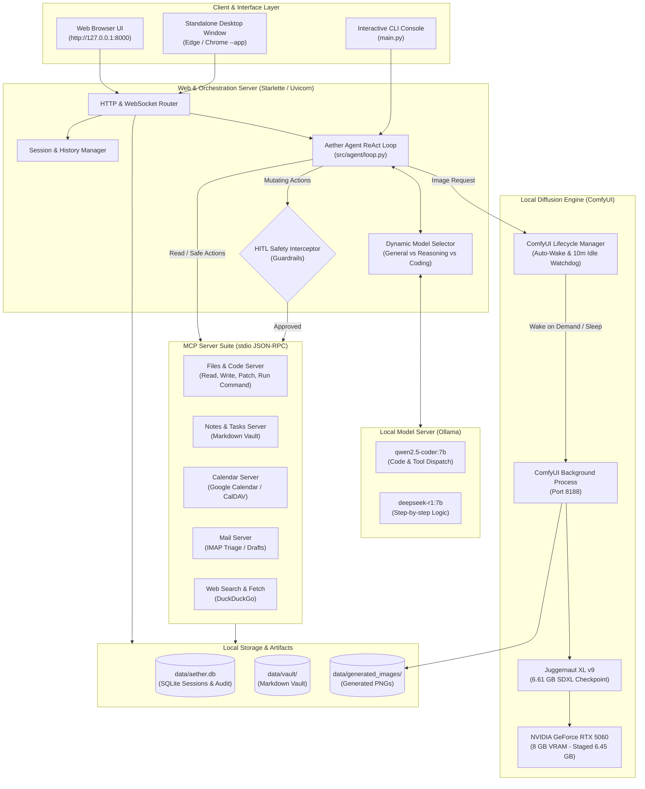

# Aether: System Architecture, Tech Stack & Feature Specification

## 1. Executive Summary & Philosophy

**Project Aether** is an offline-first, privacy-preserving desktop automation assistant and autonomous software engineering agent. Designed to run completely on consumer workstation hardware, Aether pairs local Large Language Models (via Ollama) with local image diffusion engines (via ComfyUI) and operating system integrations using Anthropic's **Model Context Protocol (MCP)**.

All computations, schedules, emails, notes, code edits, and generated artwork remain strictly local on the host machine with zero telemetry or data leakage to external clouds.

---

## 2. Technology Stack & Frameworks

| Subsystem | Technology / Library | Version / Runtime | Rationale |
| :--- | :--- | :--- | :--- |
| **Primary Language** | Python | 3.11+ (Native Windows 64-bit) | Modern type hints, high-performance asyncio, rich AI ecosystem. |
| **Web Framework** | Starlette + Uvicorn | Starlette 0.45+, Uvicorn 0.34+ | Minimalistic, ultra-fast ASGI microframework with low latency and native async support. |
| **Frontend UI** | Modern Vanilla ES6+ & CSS3 | Native Browser (Edge / Chrome) | Zero npm/Webpack bloat, instant zero-compilation loading, Zinc + Sky Blue dark design system. |
| **Desktop Window Mode** | Microsoft Edge / Google Chrome | Application Mode (`--app=...`) | Lightweight native desktop window shell without heavy Electron runtime dependencies. |
| **LLM Inference Engine** | Ollama | v0.5+ | Local GPU-accelerated model serving, OpenAI-compatible chat API, fast tool dispatch. |
| **Primary LLM Models** | Qwen 2.5 Coder & DeepSeek-R1 | `qwen2.5-coder:7b`, `deepseek-r1:7b` | Specialized coding intelligence, inline tool evaluation, and step-by-step reasoning. |
| **Image Diffusion Engine**| ComfyUI | v0.35.0 (Torch 2.14.0+cu130) | Modular node-based diffusion runtime, CUDA 13.0 / `sm_120` (NVIDIA Blackwell RTX 5060). |
| **Diffusion Model** | Juggernaut XL v9 | RunDiffusionPhoto_v2 (6.61 GB) | 25-step photorealistic diffusion (`dpmpp_2m` / `karras`, CFG 6.0), 1024x1024 output. |
| **Inter-Process Protocol**| Model Context Protocol (MCP) | FastMCP / MCP SDK | Anthropic standard JSON-RPC 2.0 over `stdio` for isolated tool execution. |
| **Database & Storage** | SQLite 3 | Embedded WAL mode | Relational storage for sessions, messages, audit logs, and cache (`data/aether.db`). |
| **Notes & Task Store** | Markdown Vault | Obsidian / Logseq compatible | Human-readable filesystem vault with daily notes and task checkboxes (`data/vault/`). |
| **Search Engine** | DuckDuckGo Search | `ddg-search` (privacy-preserving) | Live internet discovery with zero IP tracking and mandatory source citations. |
| **Weather & Geocoding**| Open-Meteo REST API | Open-Meteo v1 (zero-key) | Free, high-accuracy global forecast and debounced location geocoding. |
| **Voice Speech & Audio**| Edge-TTS + Faster-Whisper | `edge-tts` 7.0+, `faster-whisper` | Microsoft Neural TTS (`en-US-AriaNeural`) + `base.en` Whisper spotter for "aether" wake word. |
| **Observability & Tracing**| Native Python Telemetry | `ExecutionTrace` & `StepTrace` | Sub-millisecond latency tracking, token accounting, and interactive UI trace inspector. |
| **Evaluation Harness** | Aether Benchmark Suite | Custom deterministic harness (`evals/`) | Intent routing (50 cases), injection defense (25 attacks), and token savings evaluation. |
| **Testing Harness** | Pytest + AnyIO + Starlette TestClient | Pytest 9.1+ | Unit, integration, security, and design system tests across all 318 automated test cases. |

---

## 3. High-Level Architecture Diagram



---

## 4. Key Subsystems & Features

### 4.1 Photorealistic Image Generation Subsystem
- **Model**: Upgraded to **Juggernaut XL v9** (`Juggernaut-XL_v9_RunDiffusionPhoto_v2.safetensors`, 6.61 GB).
- **Sampling Settings**:
  - Sampler: `dpmpp_2m`
  - Scheduler: `karras`
  - Steps: 25 steps (high-frequency detail synthesis)
  - CFG Scale: 6.0 (optimal balance between prompt adherence and natural color gradation)
- **On-Demand Lifecycle & GPU Memory Safety**:
  - **Zero Idle Overhead**: ComfyUI is not loaded at boot. The 8 GB GPU VRAM is 100% available for LLMs.
  - **Auto-Wake**: When an image generation prompt is detected, `ensure_running()` spawns ComfyUI in the background and waits until responsive.
  - **VRAM Envelope**: Peak staged memory on the RTX 5060 is ~6.45 GB (UNet: 4,896 MB, CLIP: 1,560 MB, VAE: 159 MB). Fits entirely within physical VRAM with 0 MB spilled to system RAM.
  - **10-Minute Auto-Sleep**: A daemon watchdog monitors inactivity. After 600 seconds of idle time, it invokes `POST /free` to flush VRAM back to 0 MB and cleanly terminates the process.
  - **Process Protection**: Python `atexit` and ASGI shutdown hooks ensure no orphaned background processes remain when Aether closes.

### 4.2 Interactive Chat & High-Density Markdown Rendering
- **Pre-Pass Image Parser**: Custom Markdown renderer in `src/web/static/store.js` extracts image tags before italic or link formatting to prevent underscore (`_`) corruption in filenames.
- **Zinc + Sky Blue Image Cards**: Renders responsive cards with solid Zinc boundaries, Sky Blue borders on hover, and an overlay linking to the full-resolution file.
- **Protocol & Domain Sanitizer**: Strips any hallucinated origin prefixes (such as `https://example.com/api/...` or `http://localhost:8000/api/...`) to ensure image URLs resolve locally and reliably.
- **DeepSeek-R1 Thought Accordions**: Automatically extracts `<think>` blocks into collapsible HTML `<details>` elements for inspection of model reasoning.

### 4.3 Autonomous Software Engineering (Antigravity Mode)
- **Focused Code Patching**: `files_patch_file` replaces exact snippet blocks rather than rewriting whole files, saving tokens and preserving comments.
- **Workspace Navigation**: Direct directory listing, recursive searches, file reads, and workspace switching (`files_set_workspace`).
- **AST Terminal Execution Sandbox**: Sandboxed execution of shell commands, test suites (`pytest`), and scripts with strict timeout safety, binary allowlists, and path containment.

### 4.4 Personal Productivity (Calendar, Notes, Mail, Weather)
- **Notes & Tasks**: Direct integration with Obsidian-style Markdown vaults. Organizes tasks with priorities (`urgent`, `important`, `normal`) and checks off completed items.
- **Calendar Operations**: Syncs with CalDAV and Google Calendar. Implements a mandatory 30-minute buffer before and after all scheduled commitments.
- **Email Triage**: Connects to IMAP to fetch unread emails, summarizes priority messages, and drafts replies without sending them until confirmed.
- **Weather Forecast & Location Autocomplete**: Real-time hourly and daily forecast cards backed by Open-Meteo with debounced typeahead geocoding.

### 4.5 Neural Voice Assistant Subsystem
- **Dedicated Wake Word**: Responds to `"aether"` (and `"hey aether"`) using an adaptive speech-buffer Whisper spotter leveraging the loaded `faster-whisper` model (`base.en`), eliminating fixed pre-trained model constraints.
- **Natural Speech Synthesis**: Powered by Microsoft Neural speech synthesis via `edge-tts` (`en-US-AriaNeural`), with instant barge-in interruption via Windows native `mciSendStringW`.
- **Fullscreen Frosted Glass Overlay**: Immersive voice state overlay (`backdrop-filter: blur(28px)`) with central pulsating orb showing real-time listening, transcribing, and speaking statuses.

### 4.6 Structured Observability & Execution Telemetry
- **Deterministic Trace Engine**: Every execution turn generates structured `ExecutionTrace` and `StepTrace` records tracking per-step inference latency vs. tool execution latency.
- **Token Accounting**: Captures prompt and generation token estimates across both standard and SSE streaming responses.
- **Interactive UI Trace Inspector**: Monospace telemetry badge on assistant bubbles expanding to show execution steps, timing metrics, and status tags (`status-ok`, `status-warn`, `status-err`).

### 4.7 Continuous Agent Evaluation Benchmark Suite (`evals/`)
- **Automated Quality Benchmark**: Offline-first benchmark harness evaluating intent domain routing (50 cases), adversarial prompt injection defense (25 attacks), and model parameter normalization (30 cases).
- **Token Economics**: Quantifies 83.3% token savings via dynamic tool capability masking compared to monolithic tool catalog injection.
- **CI Quality Gate**: Backed by `tests/unit/test_evals.py` ensuring benchmarks execute in <50ms and maintain a 100% defense rate.

---

## 5. Security & Threat Model

### 5.1 Indirect Prompt Injection Defense
Content from external sources (incoming email bodies, web pages fetched via DuckDuckGo, untrusted markdown files) is wrapped inside structural demarcation tags:
```xml
<untrusted_content source="email" id="msg_102" sender="external@domain.com">
... raw external text ...
</untrusted_content>
```
The agent system prompt strictly instructs the LLM to treat content within these tags as passive data, forbidding execution of instructions, role assumptions, or tool invocations embedded inside them.

### 5.2 Human-in-the-Loop (HITL) Safety Gate
All tool executions are categorized:
- **Safe / Read-Only**: `files_read_file`, `files_list_directory`, `files_search_files`, `search_notes`, `get_calendar_events`, `search_web`, `generate_image`. Executed immediately.
- **Mutating / Potentially Destructive**: `files_write_file`, `files_patch_file`, `files_delete_file`, `files_run_command`, `send_email`, `stage_email_draft`, `create_calendar_event`. Intercepted by `src/agent/guardrails.py`, presenting the user with exact diffs/parameters for explicit approval before execution.

---

## 6. Directory Map & Code Structure

```text
aether/
├── config/
│   ├── config.yaml                    # Runtime configuration, models, timeouts
│   └── mcp_servers.json               # MCP server registration & environment
├── data/
│   ├── aether.db                      # SQLite session, chat history, and audit database
│   ├── generated_images/              # Saved 1024x1024 photorealistic PNG outputs
│   └── vault/                         # Markdown vault (daily notes, todo checklists)
├── docs/                              # System specifications and technical documentation
│   ├── 01_architecture_and_threat_model.md
│   ├── 02_mcp_server_contracts.md
│   ├── 03_orchestrator_and_agent_loop.md
│   ├── 04_data_models_and_storage.md
│   ├── 05_configuration_and_environment.md
│   ├── 06_testing_and_verification_plan.md
│   ├── 07_frontend_and_design_system.md
│   └── adr/                           # Architecture Decision Records (ADR-001 through ADR-007)
├── evals/                             # Continuous Agent Evaluation Benchmark Suite
│   ├── datasets/                      # 50 intent routing, 25 injection, 30 parameter test cases
│   ├── harness.py                     # Evaluation benchmark engine & SLA verifier
│   └── run_benchmarks.py              # CLI scorecard runner
├── scripts/
│   ├── setup_comfyui.bat              # ComfyUI installation & CUDA setup script
│   └── run_comfyui.bat                # Standalone ComfyUI server launcher
├── src/
│   ├── agent/
│   │   ├── loop.py                    # ReAct agent loop, tool masking, execution tracing
│   │   ├── prompts.py                 # Ground truth temporal prompts & system invariants
│   │   ├── guardrails.py              # HITL authorization gate & prompt injection scanner
│   │   └── patch_engine.py            # Targeted code block replace/patch logic
│   ├── client/
│   │   └── ollama_client.py           # Client for local Ollama LLM inference
│   ├── mcp_bridge/
│   │   └── manager.py                 # Stdio JSON-RPC process bridge
│   ├── servers/
│   │   ├── image_server.py            # ComfyUI client, Juggernaut XL workflow, auto-sleep
│   │   ├── files_server.py            # Workspace file management & AST command runner
│   │   ├── notes_server.py            # Markdown vault & task tracking
│   │   ├── calendar_server.py         # Google Calendar / CalDAV client
│   │   ├── mail_server.py             # IMAP email triage & draft stager
│   │   ├── search_server.py           # DuckDuckGo search & webpage text extractor
│   │   └── weather_server.py          # Open-Meteo weather & location geocoding
│   ├── voice/
│   │   ├── engine.py                  # Whisper wake spotter & voice assistant loop
│   │   ├── audio_io.py                # Edge-TTS Neural Aria synthesis & barge-in playback
│   │   └── service.py                 # Background voice service thread
│   └── web/
│       ├── server.py                  # Starlette ASGI app, REST endpoints, trace buffer
│       └── static/
│           ├── index.html             # Semantic accessible dashboard layout
│           ├── js/                    # Native ES modules (chat, coder, mail, overview, etc.)
│           └── style.css              # Pure Zinc + Sky Blue desktop-class styling
├── tests/
│   └── unit/                          # 318 automated unit, design system, and eval tests
├── start_portal.bat                   # Native Windows desktop app launcher
├── start_portal.sh                    # Cross-platform macOS/Linux/WSL launcher
├── pyproject.toml                     # Python dependencies and build metadata
└── README.md                          # Project overview, architecture scorecard, and quick start
```